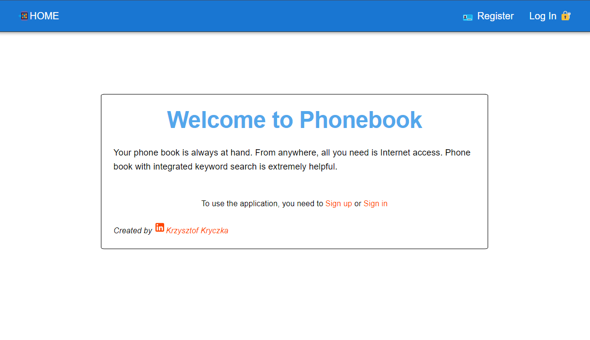
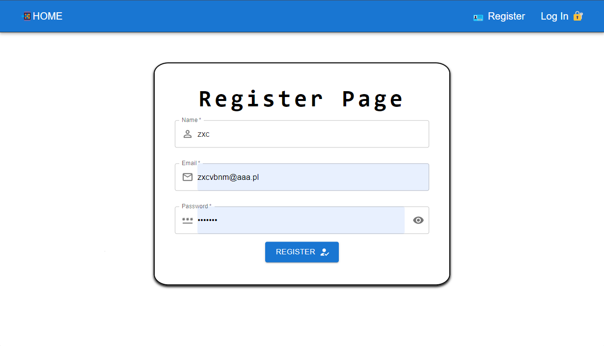
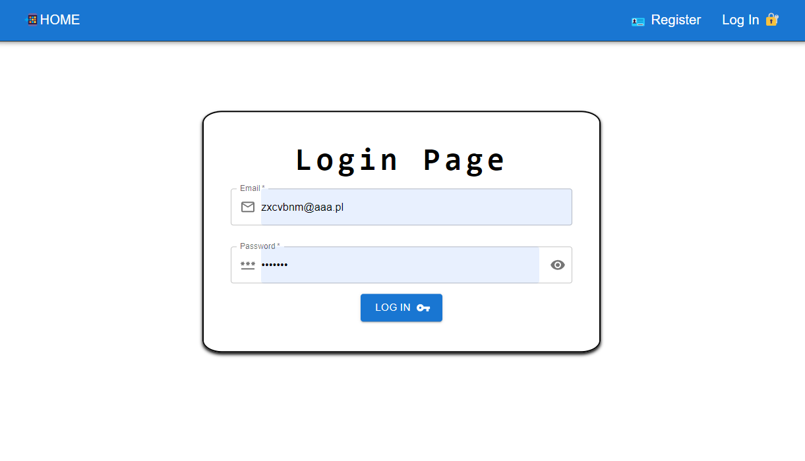
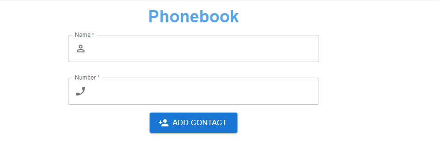
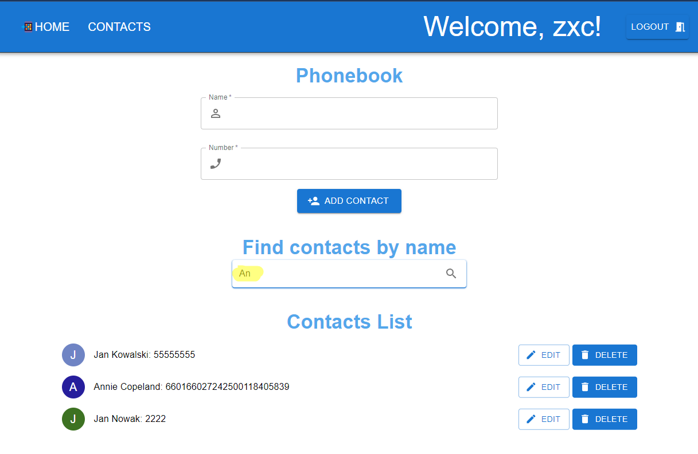
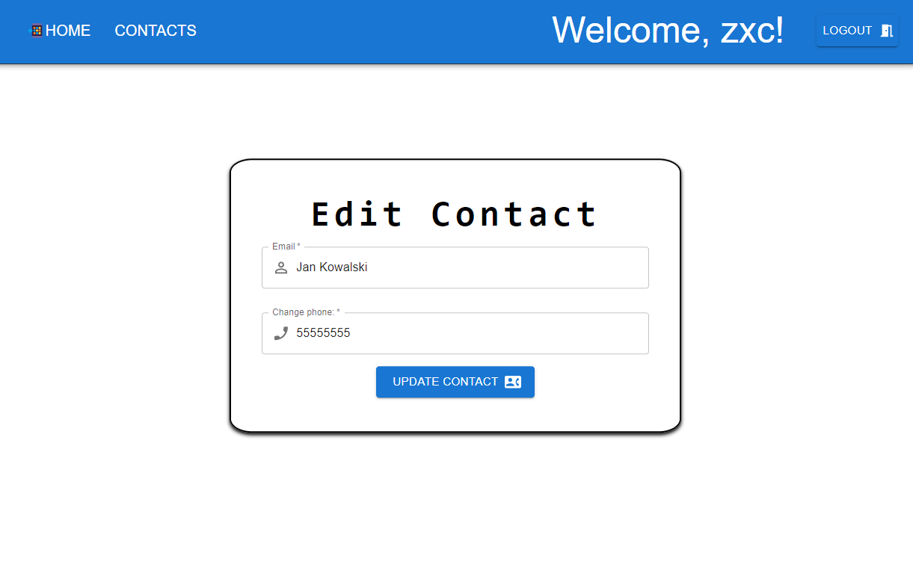

# Phonebook App

Phonebook is a simple React application that allows you to manage a list of
contacts. You can add new contacts, delete existing ones, and filter the list to
find specific contacts. This readme file provides an overview of the Phonebook
application and how to use it.




- **Add a Contact**: You can add a new contact to the phonebook by providing
  their name and phone number.


- **Delete a Contact**: You can remove a contact from the phonebook.

- **Filter Contacts**: You can filter the list of contacts by name to quickly
  find the ones you're looking for.


- **Edit Contact**: You can edit your Contact

## Installation

To run the Phonebook application locally, follow these steps:

1. Clone the repository:

   ```bash
   git clone [repository-url]

   ```

2. Change to the project directory:

   ```bash
   cd [repository-name]

   ```

3. Install and start dependencies:
   ```bash
   npm install
   npm run dev
   npm start
   ```

The application should now be accessible in your web browser at
http://localhost:3000.

## How it works

The main component is **App**, defined in **App.jsx**.